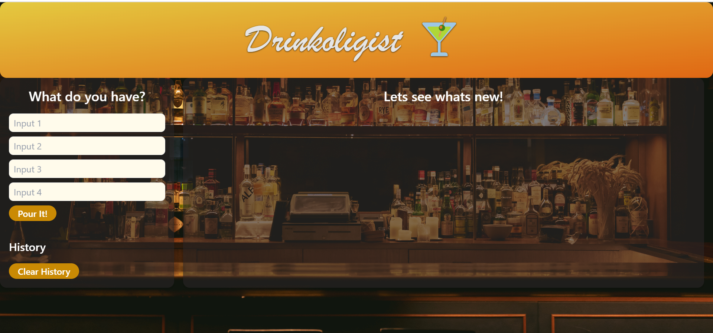
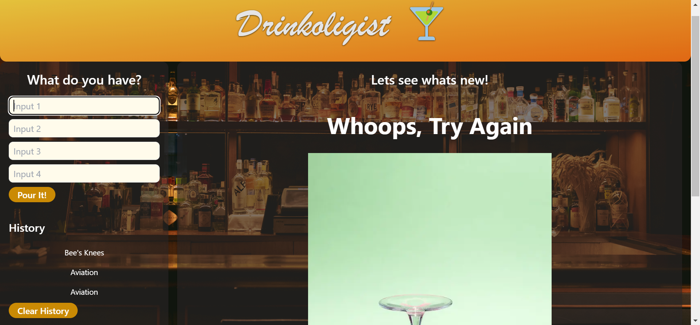

# Group_Project_1-Drinkologist

## Description 
This is a web program that takes an input of various ingredients and outputs an image of a drink including the supplied ingredients, all ingredients in the drink, and instructions to make the drink.  Previous search results are saved in local storage, displayed in the history section and clicking on previous results will bring those results back to the main display area.
This app will run in the browser and feature dynamically updated HTML and CSS framework (Tailwinds) powered by javascript and 2api.

 ## Table of contents.
     1. 4 text input fields.
     2. search button. 
     3. history items saved in local storage as buttons.
     4. clear history button.
     5. container to display drink name, image, ingredients and recipe.

 ### page:
 when the user runs the page it will show an input text fields to let user pass ingredients on hand.
 suggested cocktail will be displayed colleted from open api.
 name of the cocktail on top.
 image for the cocktail in the middle. 
 ingredients and recipe will also be displayed at the bottom.
 

 ## Usage.
  Type ingredients user possesses into the input boxes in the left collumn of the page.
  When the "Pour it" button is pushed, a drink will be selected from a database and provide an image and recipie for that drink.
  Click on one of the buttons in the history section to display a previously shown drink.
  
 ## Screenshots.

## Roadmap
A third Column will be added and used to display ingredients from an online market to let user buy if needed.

## Authors and acknowledgment:
Developers:
Michael Pigott (https://github.com/Michaelepigott)
Mahmoud Abdelgawad (https://github.com/Nabil1294)
Josh Bowen (https://github.com/JBowen96)
Daniel Diaz (https://github.com/Double-D1)
Nico Bott (https://github.com/nicosbott)

## APIs:
https://api-ninjas.com/api/cocktail
Thecocktaildb.com/api.php

### Deployed Page Link:

## Credits.

setting local storage
https://stackoverflow.com/questions/40791207/setting-and-getting-localstorage-with-jquery

local storage getting value
https://www.w3schools.com/jsref/met_storage_getitem.asp

clearing previous content in element
https://www.tutorialspoint.com/how-to-clear-all-div-s-content-inside-a-parent-div-in-javascript#:~:text=Using%20the%20innerHTML%20property%20of%20the%20HTML%20element&text=We%20can%20access%20the%20element,elements%20inside%20a%20parent%20div.

button event listener 
https://herewecode.io/blog/create-button-javascript/

How to Select a Random Element From Array in JavaScript
https://linuxhint.com/select-random-element-from-an-array-javascript/

## License

